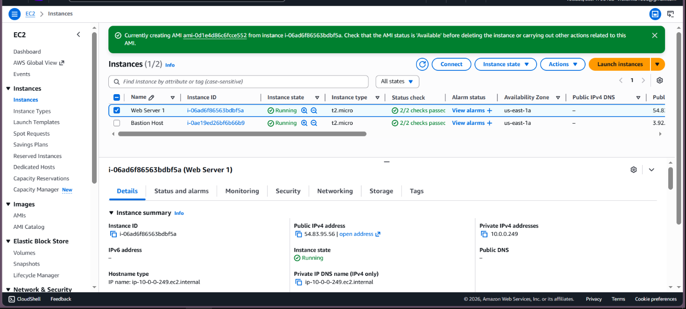
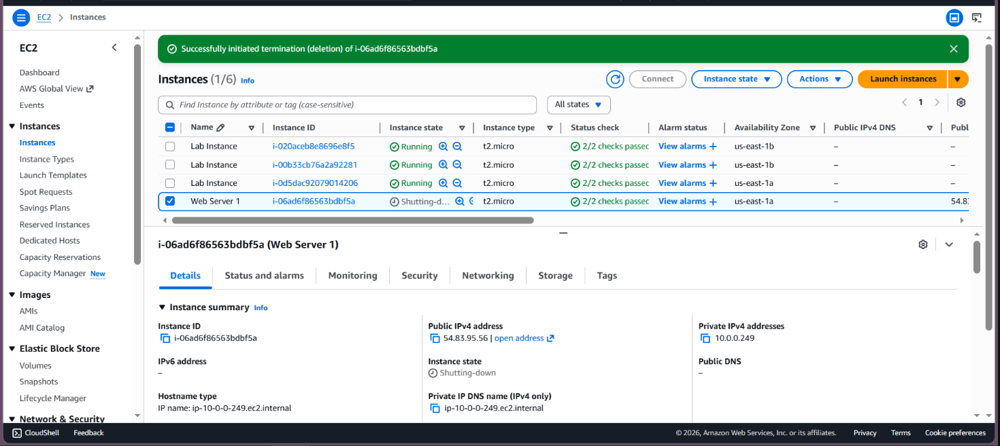

# Lab 6 – Scale and Load Balance Your Architecture

## Title

Scale and Load Balance Your Architecture
Author : A.NABITHRA
Reg no : 212224230172
Date : 15.03.2026

---

## Objective

The objective of this lab is to understand how to design a scalable and highly available architecture on AWS using Auto Scaling and Elastic Load Balancing. This experiment focuses on distributing incoming traffic across multiple EC2 instances, automatically scaling resources based on demand, and validating fault tolerance.

---

## Prerequisites

* Basic knowledge of Amazon EC2 and VPC
* Completion of previous labs (IAM, EC2, EBS, Database Server)
* AWS Academy Lab access
* Stable internet connection

---

## Tools Used

* AWS Management Console
* Amazon EC2
* Elastic Load Balancer (ELB / ALB)
* Auto Scaling Groups (ASG)
* Amazon CloudWatch

---

## Tasks Performed

### Task 1: Review Existing Architecture

Students review the existing EC2-based application architecture created in previous experiments.

### Task 2: Create a Launch Template

Students create a launch template that defines the EC2 instance configuration including AMI, instance type, security group, and user data.

### Task 3: Create an Auto Scaling Group

Students create an Auto Scaling Group using the launch template and configure minimum, maximum, and desired instance capacity.

### Task 4: Configure an Application Load Balancer

Students create an Application Load Balancer and configure target groups for routing traffic to EC2 instances.

### Task 5: Register Auto Scaling Group with Load Balancer

Students attach the Auto Scaling Group to the target group of the load balancer.

### Task 6: Configure Scaling Policies

Students configure scaling policies based on CPU utilization using Amazon CloudWatch alarms.

### Task 7: Test Load Balancing and Scaling

Students test the setup by generating traffic and observing automatic scaling and load distribution.

---

## Workflow (To be filled by Student)

Describe step-by-step how you performed this experiment in your own words.

1. Reviewed the existing EC2 architecture created in previous labs to understand the application setup.

2. Created a launch template by selecting the AMI, instance type, security group, and adding required configurations.

3. Created an Auto Scaling Group using the launch template and set the minimum, maximum, and desired number of instances.

4. Configured an Application Load Balancer and created a target group to route traffic to EC2 instances.

5. Attached the Auto Scaling Group to the load balancer target group so instances can receive traffic.

6. Set scaling policies using Amazon CloudWatch alarms based on CPU utilization.

7. Generated traffic to test load balancing and verified that instances scaled automatically based on demand.

## Output Screenshots 

## Result

This experiment demonstrated how to build a scalable and fault-tolerant cloud architecture using Auto Scaling Groups and Elastic Load Balancing. The system automatically adjusted resources based on workload and ensured continuous service availability by distributing traffic across multiple instances.
